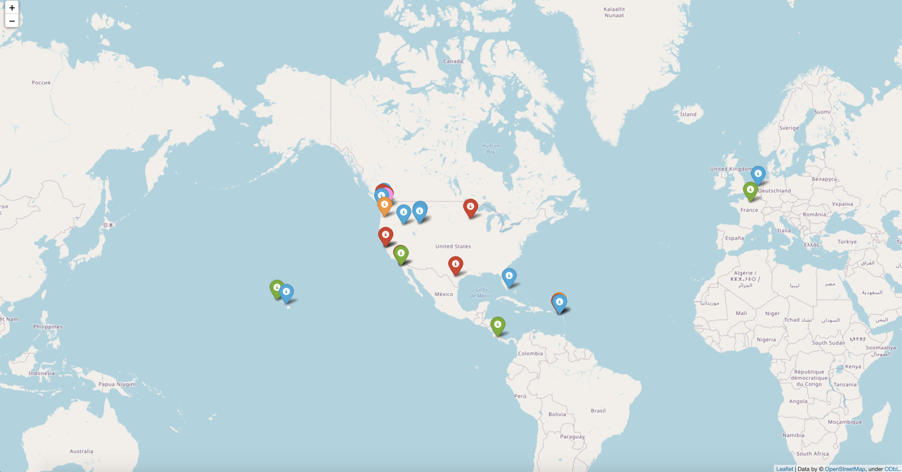

# Interactive Map of the World

A web-based mapping project built with:

* Python
* Folium
* Pandas
* .txt file for data storage

The output of the program is a global map with markers placed in locations determined by the contents of the .txt file. When the user hovers over the color-coded markers, additional information apperas within each marker (determined, again, by the contents of the .txt file) with interactive pop-ups and color coding to identify number of times a place has been visited.



By changing the data in the txt file, you can change both the location of the markers and the pop-up information provided by the markers.

For example, a properly formatted .txt file for this project should have the following format:

```txt
DESTINATION,VISITS,LATITUDE,LONGITUDE
Quinault WA,2,47.46028,-123.802838
Saba,20,17.633333333333,-63.239444444444
Sint Eustatius,2,17.4826800,-62.9832400
```

|Column Name|Description|Example|
|----|----|----|
|DESTINATION|The location name where the marker should be placed|Quinault, WA|
|VISITS|The number of times the user has been to the destination|2|
|LATITUDE|The latitude of the destination|47.46028|
|LONGITUDE|The longitude of the destination|-123.802838|

An online search for a locations coordinates will quickly provide you with latitude and longitude values.

## How To Use this Repo to Run the Program and Build the Map

1. Clone the GitHub repo into your local machine.
2. Create a virtual environment, such as with the command `pipenv shell`
3. Open your code editor, such as VS Code
4. Install folium and pandas into your virtual environment
5. Run the program using your code editor
6. A .html file will be built, and placed at the root level of the repo directory
7. Drag the .html file into the URL bar at the top of the browser window.
8. A global map with markers should appear after the page loads. 

## Contributor

Sharina Stubbs
